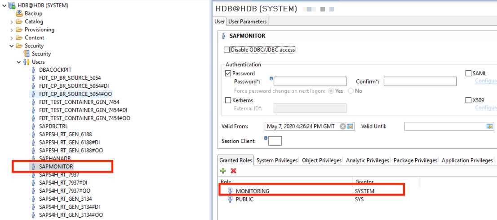

# Create a SAP User for Monitoring

Luckily SAP has already provided the required role for us.

Simply go and logon to HANA Studio or Cockpit and create a new technical user e.g. called SAPMONITOR.
Add the role 'MONITORING', specify a password and save.

(Optional) To avoid password expiration, you can disable the lifetime by running the following SQL

> ALTER USER SAPMONITOR DISABLE PASSWORD LIFETIME;

You are all set!
